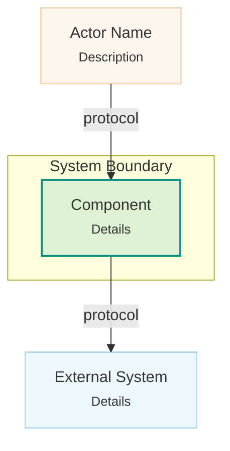

# Atlas Site Build

**Trigger:** "Generate the atlas site", "build the HTML for the atlas", "promote the atlas to a website", or after completing an atlas with `brownfield-atlas-genesis`.

## Prerequisites

- Atlas markdown files exist at `/mnt/hermes/projects/<project>/atlas/`
- Build tool lives at `/mnt/hermes/source/atlas-site/` (repo: yoniebans/atlas-site)
- Output goes to `/mnt/hermes/source/<project>-atlas/` (its own repo, publishable)

## Build Command

```bash
python /mnt/hermes/source/atlas-site/build.py \
  /mnt/hermes/projects/<project>/atlas \
  --title "<Project Name>" \
  --out /mnt/hermes/source/<project>-atlas
```

## What It Produces

- `index.html` — landing page with category cards linking to each diagram page
- One HTML page per atlas file — diagram with zoom/pan + annotations below
- **Each page is self-contained** — CSS and JS are inlined, no external file dependencies
- Prev/next navigation between pages
- Sticky sidebar TOC with color-coded categories

## Atlas File Convention (expected structure)

```
atlas/
├── 01-context.md          → accent (sky blue)   — C4 L1
├── 02-containers.md       → teal               — C4 L2
├── 03-components/         → emerald            — C4 L3
│   └── *.md
├── data-model.md          → indigo             — UML ER
├── flows/                 → amber              — UML sequence
│   └── *.md
└── deployment.md          → rose               — UML deployment
```

Each file must contain:
1. An H1 title (`# ...`)
2. A mermaid code block (` ```mermaid ... ``` `)
3. Bullet annotations after the last code fence (`- ...`)

## Design system canonical home

The shared design system assets are canonically hosted at **yoniebans.github.io** (repo: `yoniebans/yoniebans.github.io`). Files at root: `styles.css`, `mermaid-zoom.js`, `scrollspy.js`, `page-nav.js`, `enhancer.js`, `presentation.js`, `presentation.css`, `theme.js`.

Consumer repos inherit via git submodule (see "Canonical design system home" under Design Patterns). Pages within the base repo use relative paths (`../styles.css`) — absolute paths break PR preview deployments at `/pr-N/atlas/`.

**Submodule workflow for consumer repos:**
```bash
# Initial setup
git submodule add https://github.com/yoniebans/yoniebans.github.io.git base
# Update to latest
git submodule update --remote base && git add base && git commit -m "chore: update base submodule"
```
CI: add `submodules: true` to `actions/checkout@v4`. Local clone: `git clone --recurse-submodules` or `git submodule update --init` after clone.

## Separation of Concerns

| What | Where | Git repo |
|---|---|---|
| Build tool + design system | `/mnt/hermes/source/atlas-site/` | yoniebans/atlas-site |
| Visual design reference + canonical CSS/JS | `yoniebans.github.io` root (repo: `yoniebans/yoniebans.github.io`) | yoniebans/yoniebans.github.io |
| Hand-authored atlas reference | `/mnt/hermes/source/hermes-architecture/` | yoniebans/hermes-architecture (inherits base/ via submodule) |
| Atlas markdown (source of truth) | `/mnt/hermes/projects/<project>/atlas/` | stays in project dir |
| Generated HTML output | `/mnt/hermes/source/<project>-atlas/` | yoniebans/<project>-atlas |

Atlas markdown is Obsidian-friendly and stays in the projects dir. Generated HTML is a proper publishable repo (GitHub Pages, etc.).

### hermes-architecture inherits via submodule

The `hermes-architecture` repo is a **hand-authored HTML design reference** — mine it for palette, typography, card vocabulary, zoom-engine patterns, etc. It inherits the design system from yoniebans.github.io via a `base/` git submodule, so its CSS/JS stays in sync. It **violates atlas discipline** (multiple diagrams per page, prose-heavy, mixes decisions/gotchas into architecture pages, no per-layer file split, not generated from markdown). Do not use it as a page-structure template for atlas-site output.

### Canonical design system home

The shared design system assets are canonically hosted at **yoniebans.github.io** (repo: `yoniebans/yoniebans.github.io`). Root files: `styles.css`, `mermaid-zoom.js`, `scrollspy.js`, `page-nav.js`, `enhancer.js`, `presentation.js`, `presentation.css`, `theme.js`.

**Submodule inheritance (preferred for separate repos):** Consumer repos (e.g. hermes-architecture) add yoniebans.github.io as a git submodule at `base/`, then reference assets as `base/styles.css`. This gives one-directional, version-pinned inheritance with zero drift. Update with `git submodule update --remote base`. CI needs `submodules: true` on `actions/checkout@v4`.

**Subdirectory inheritance (for pages within the base repo):** Pages in subdirectories (e.g. `atlas/index.html`) use relative paths (`../styles.css`). Absolute paths break PR preview deployments.

**`<head>` setup (exact order):** (1) CSS: `styles.css`, `presentation.css`. (2) Mermaid CDN + `mermaid.initialize({ startOnLoad: false, ... })`. (3) `theme.js`.

**Body scripts (all `defer`, exact order):** `mermaid-zoom.js`, `page-nav.js`, `scrollspy.js`, `presentation.js`, `enhancer.js`, then any project-specific scripts like `refs.js`. `page-nav.js` must load before `scrollspy.js` — it rewrites hrefs from `page.html#sec` to `#sec` for the active page so scrollspy can bind them. All scripts must have `defer` — inconsistent `defer` causes race conditions.

## Mermaid Diagram Types — CRITICAL

**Do NOT use Mermaid C4 syntax** (`C4Context`, `C4Container`, `C4Component`). These are experimental and render poorly or not at all in the atlas site viewer — diagrams appear blank unless opened fullscreen, and even then are unreliable.

**Instead, use `graph TD` with `classDef` styling** to represent C4 concepts. This is what the reference site (yoniebans/hermes-architecture) does and it renders perfectly. Pattern:



**Safe diagram types:** `graph TD`, `sequenceDiagram`, `erDiagram`, `classDiagram`. These all render reliably.

Use `stroke-dasharray: 5 5` in classDef for planned/future components.

## Pitfalls

- **CSS and JS must be inlined** — external `<link>` and `<script src>` cause race conditions where the zoom/pan viewport reads dimensions as 0 before styles load, resulting in invisible diagrams that only appear when opened fullscreen. The build tool now inlines both into each HTML page (same pattern as the working hermes-architecture reference site). The `assets/` directory is the single source of truth; the build tool reads from there and inlines at build time.
- **Do NOT set min-height on diagram containers.** mermaid-zoom.js now sizes containers from the SVG's natural pixel dimensions (`svgH + padding`). Hardcoded CSS `min-height` or inline `style="min-height:400px"` on `.mermaid-wrap` creates oversized containers for small diagrams. The JS config `minHeight` is set to 120 (a floor, not a default).
- **Diagram zoom defaults to 100%, centered.** `fitDiagram()` centers the SVG when it's smaller than the viewport at 100% zoom. When the diagram overflows the viewport, it falls back to top-left with padding. `maxInitialZoom` is capped at 1.0.
- **Mermaid LR subgraphs stack vertically by default.** When two `subgraph` blocks in a `graph LR` have no edges between them, Mermaid places them top-to-bottom. Add an invisible link between subgraph IDs (`old ~~~ new`) to force side-by-side layout.
- **External `<script type="module" src="...">` breaks `file://` preview silently** — even though inlining avoids this, be aware: if you ever refactor the build to emit external module scripts, Chrome will block the fetch from `file://` (null-origin CORS) and diagrams won't render when users open the HTML locally. GitHub Pages will still work. The symptom is "page loads with HTML+CSS but no interactive JS features." Use classic `<script src="x.js" defer>` + IIFE if you must extract, or keep inlining. See `static-site-local-preview` skill for the full picture.
- **Do NOT use Mermaid C4 syntax** — see section above. This was discovered the hard way: all structural diagrams had to be rewritten after the initial build.
- **Do NOT HTML-escape Mermaid source** — it goes inside `<script type="text/plain">` which is not parsed as HTML. The build tool handles this correctly now (was a bug in v1).
- **Inline markdown in annotations** — `**bold**` and `` `code` `` are rendered to HTML in annotation bullets. The build tool handles this.
- **Files not in FILE_ORDER are skipped** — `README.md`, `.component-inventory.md`, and other non-diagram files are intentionally excluded. Only the standard atlas file patterns are picked up.
- **Mermaid `startOnLoad: false` is mandatory** — the Mermaid CDN script must be followed immediately by `<script>mermaid.initialize({ startOnLoad: false, theme: 'dark', themeVariables: { ... }});</script>`. Without this, Mermaid auto-renders on DOMContentLoaded, racing with `mermaid-zoom.js` which handles rendering manually. Symptom: diagrams flash, render twice, or presentation mode shows lag as animations replay. The atlas page does this correctly — copy its pattern.
- **`.anim` fadeUp animations break presentation mode** — the `.anim` class applies `animation: fadeUp 0.4s ease-out` with staggered delays (`--i`). When presentation mode reveals a slide, these animations replay, causing a visible fade-in lag. Fix: `presentation.css` includes `body.presentation-mode .anim { animation: none !important; opacity: 1 !important; transform: none !important; }`. This was added to the base design system. Pages without `.anim` (like the atlas) are unaffected.
- **Mermaid CDN dependency** — `engine.js` imports Mermaid v11 from jsdelivr CDN. Pages need internet on first load (browser caches afterward). For fully offline, vendor the mermaid bundle.
- **Mermaid edge label clipping** — Mermaid v11 calculates SVG text bounding boxes slightly too narrow for edge/link labels, causing the last 1-2 characters to be visually clipped. Trailing spaces are trimmed by the parser, so `|"text "|` does NOT work. Workaround: append `&ensp;` (en-space HTML entity) to the label — `|"can't externalise&ensp;"|`. Longer labels may need `&ensp;&ensp;`. This is a Mermaid bug, not a CSS issue — a global CSS override on `.edgeLabel` rects would be the proper fix but hasn't been implemented yet.
- **Diagram fullscreen: mermaid-wrap collapses to 0 width** — `.mermaid-wrap` has `overflow: hidden` and absolutely-positioned content, so it collapses to 0 width when the parent `.diagram-shell` enters native fullscreen. The fix in `styles.css` uses `!important` to override the inline `height` set by `setAdaptiveHeight()`: `.diagram-shell:fullscreen .mermaid-wrap { width: 100% !important; height: 100% !important; max-width: none; max-height: none; }`. Also hide `.diagram-shell__hint` in fullscreen — without `display: none`, the hint sits beside the diagram as a flex sibling, stealing space. The JS `fullscreenchange` handler must also call `fitDiagram()` on *enter* (via `requestAnimationFrame` to let layout settle), not just on exit — otherwise the diagram stays at its pre-fullscreen size. Diagnosed via browser console: `document.fullscreenElement` confirmed fullscreen was active, but `.mermaid-wrap` reported `0xN` dimensions.
- **Diagram fullscreen on mobile** — `window.open` with blob URLs is blocked by mobile popup blockers. `mermaid-zoom.js` now uses the native Fullscreen API (`requestFullscreen`) with a CSS overlay fallback (`.diagram-overlay`) for iOS Safari which doesn't support Fullscreen API on non-video elements. The overlay has a dark backdrop with blur, tap-to-close, and a close button.
- **CSS cascade order for multi-file button styling** — when `.pres-toggle` base styles live in `presentation.css` and mobile overrides are in `styles.css`, the base rule wins because `presentation.css` loads later (equal specificity, later file wins). Mobile overrides for `.pres-toggle` must live in `presentation.css` itself, in a `@media` block. Same principle applies to any component whose base styles are in a secondary CSS file.
- **Presentation mode requires `<section id="...">` wrappers** — `presentation.js` detects slides via `section[id]` selectors. Pages that use flat `<div class="sec-head" id="...">` markers without wrapping `<section>` elements will fail silently — the 🎬 button appears but no slides are detected, so the page goes blank. Every content block must be wrapped in `<section id="semantic-name">...</section>`. The `<section class="diagram-shell">` elements nested inside main sections are fine — CSS targets `.main > section` (direct children only).
- **Intro content must live inside the first `<section>`** — h1, subtitle, lead text, KPI rows, and any other intro content before the first section break must be wrapped inside `<section id="overview">` (or whatever the first section is). If intro content sits outside any `<section>`, it remains visible alongside slides in presentation mode, breaking the experience. The atlas/ page does this correctly — use it as the structural reference.
- **Local viewing needs a server** — ES module imports are blocked from `file://` protocol. Use `python3 -m http.server 8765` and open `http://localhost:8765`.
- **Never push to GitHub without explicit user permission** — the output repo is source-controllable but the user decides when/if to push it.

## After Building

View locally:
```bash
cd /mnt/hermes/source/<project>-atlas
python3 -m http.server 8765
# open http://localhost:8765
```

## Design Patterns Worth Reusing

These emerged from the hermes-architecture refactor and are candidates for the atlas-site build tool to emit by default.

### Semantic section IDs (stable cross-page anchors)

Every section on every atlas page gets a short kebab-case `id` based on the topic, NOT an ordinal (`s0`, `s1`). This makes cross-page anchors usable and stable.

- Good: `id="agent-loop"`, `id="tool-execution"`, `id="containers"`
- Bad: `id="s0"`, `id="section-4"`, `id="sec1"`

**Gotcha**: if some pages use semantic IDs and others use opaque IDs, cross-page anchors silently break without an error. Pages look fine individually; links between them go nowhere. Audit with `grep -nE 'href="[a-z-]+\.html#[^"]+"'` across all pages, then grep for each target ID on the target page to confirm it exists. Enforce semantic IDs uniformly.

### refs.json + enhancer pattern (link concepts to source repo)

For linking named concepts in the atlas (class names, file paths, module references) to their actual source in a separate repo. Authoring stays clean, links stay centralized and maintainable.

**refs.json schema** (in the site repo root):
```json
{
  "repo": "Org/repo-name",
  "branch": "main",
  "refs": {
    "tool-registry":            { "path": "tools/registry.py" },
    "ai-agent.run-conversation": { "path": "run_agent.py", "symbol": "run_conversation" },
    "gateway-runner":          { "path": "gateway/run.py" }
  }
}
```

**HTML authoring** (add to any `<code>`, `<span>`, etc.):
```html
<code data-ref="tool-registry">ToolRegistry</code>
<code data-ref="ai-agent.run-conversation">run_conversation</code>
```

**enhancer.js** (classic IIFE, loaded with `<script src="enhancer.js" defer>`):
1. `fetch('refs.json')` on DOMContentLoaded — console.warn on failure, no UI change
2. For each `document.querySelectorAll('[data-ref]')`, look up `data.refs[attr]`
3. Build `https://github.com/<repo>/blob/<branch>/<path>`; if `symbol` present, append `#:~:text=<encodeURIComponent(symbol)>` (GitHub text-fragment deep link — survives small code shifts better than line numbers)
4. Wrap the element in `<a href=... target="_blank" rel="noopener noreferrer" class="ref-link">` + append a small external-link SVG icon
5. Idempotent — use a `dataset.refEnhanced` marker to avoid double-wrapping

**CSS**: `.ref-link` inherits color from parent so `<code>` chips stay chip-styled; hover adds accent color + underline; `.ref-link__icon` at 0.75em, opacity 0.5 → 1 on hover.

**Pinning strategy**: `branch: "main"` is pragmatic — links may go stale as code moves, but authoring burden is low. Pinning to a commit SHA is better for stability but requires regenerating refs.json every time the atlas is updated. Start with `main`, pin later if drift becomes a problem.

**Scope discipline**: only add `data-ref` to chips that are clear references to a specific file/class in the repo. Skip generic mentions like `<code>JSON</code>` or `<code>~/.hermes/</code>`. Target ~20-50 load-bearing refs across a 4-page atlas, not exhaustive annotation.

### Pipeline/stepped-flow component (vertical-wrap, gradient progression)

For visual 3-5 step flows (e.g. "message arrives → agent thinks → agent acts → response sent"). Better than a prose paragraph for orientation.

**Don't**: `display: flex; overflow-x: auto` — horizontally scrolling step lists are painful on moderate widths and feel like broken layout.

**Do**:
```css
.pipeline {
  display: flex;
  flex-wrap: wrap;           /* 4 across when there's room, 2x2 when not */
  gap: 0;
  align-items: stretch;
}
.pipeline-step {
  flex: 1 1 180px;
  min-width: 160px;
  padding: 14px 18px;        /* not 10px 14px — cramped */
  /* Gradient progression via nth-child: */
}
.pipeline-step:nth-child(1) { border-left: 3px solid color-mix(in srgb, var(--accent) 25%, var(--border-bright)); }
.pipeline-step:nth-child(3) { border-left: 3px solid color-mix(in srgb, var(--accent) 55%, var(--border-bright)); }
.pipeline-step:nth-child(5) { border-left: 3px solid color-mix(in srgb, var(--accent) 80%, var(--border-bright)); }
.pipeline-step:nth-child(7) { border-left: 3px solid var(--accent); background: color-mix(in srgb, var(--accent) 8%, transparent); }
/* Odd-only nth-child because even children are .pipeline-arrow separators */
@media (max-width: 820px) {
  .pipeline-arrow { display: none; }
}
.pipeline-step .step-name { font-size: 14px; }   /* not 12 */
.pipeline-step .step-detail { font-size: 12px; } /* not 10 — 10 is too small to read */
```

Visual effect: "quiet start → emphatic end," no horizontal scroll ever, arrows appear only when steps fit on one row.

### Multi-page collapsible TOC (page-nav.js)

For multi-page atlas sites, the sidebar TOC shows all pages with expand/collapse. The current page is expanded showing subsections; sibling pages are collapsed to title-only. This replaces the old companion-page footer pattern.

**HTML contract** (identical markup in every page):
```html
<nav class="toc" id="toc">
  <a class="toc-back" href="https://yoniebans.github.io">← all posts</a>
  <div class="toc-page" data-page="index.html">
    <a class="toc-page__title" href="index.html">C4 Architecture</a>
    <div class="toc-page__sections">
      <a href="index.html#overview">Overview</a>
      <a href="index.html#containers">Containers</a>
    </div>
  </div>
  <!-- more .toc-page entries... -->
</nav>
```

**CSS classes:** `.toc-page`, `.toc-page__title`, `.toc-page__sections`, `.is-active`, `.is-collapsed`. All defined in `styles.css`.

**Behaviour:** `page-nav.js` detects current page from `location.pathname`, adds `is-active` to the matching `.toc-page`, adds `is-collapsed` to all others. Clicking active page title toggles collapse. Clicking collapsed page title navigates. Single-page sites (no `.toc-page` elements) are unaffected.

### Companion-page footer pattern (deprecated)

Replaced by the multi-page TOC above. The `.companion-grid` / `.companion-link` CSS still exists in `styles.css` but should not be used for new inter-page navigation. Remove companion footer sections when adopting the multi-page TOC.

### Wall-of-text fix for narrative sections

When a tutorial/explanation section has 4+ back-to-back `<p>` blocks describing a sequence (e.g. "First X happens, then Y, then Z..."), convert to a structured visual (numbered pipeline cards, grid of concentric-ring cards, etc.). The prose was describing a structure all along; show the structure directly.

Keep: a 1-sentence framing `<p>` before the visual and a 1-sentence closing `<p>` after it. Drop the middle 4 paragraphs in favor of the visual with short step-name + 1-sentence description per step. Word count stays roughly the same but scan-time drops dramatically.

### Component selection guide — match content type to component

The design system has distinct components for distinct content types. Using the wrong one looks "random" even if the data is correct. Reference: hermes-architecture repo (`/mnt/hermes/source/hermes-architecture/`).

| Content type | Component | Example |
|---|---|---|
| Numeric stats (counts, metrics) | `.kpi-row` > `.kpi-card` (`.kpi-card__value` + `.kpi-card__label`) | "30+ Tools", "16 Adapters", "7 Exec Backends" |
| Conceptual items (failure modes, properties, features) | `.grid-2` or `.grid-3` > `.ve-card` with `.ve-card__label` + `<p>` or `<ul class="step-list">` | "Stale steering", "No memory", "Error Recovery" |
| Sequential steps (pipelines, flows) | `.pipeline` > `.pipeline-step` (`.step-name` + `.step-detail`) + `.pipeline-arrow` | Build → Test → Deploy |
| Key insight / single callout | `.callout` | "The agent does the work. You hold the shape." |
| Tabular comparison | `.ve-card` > `table.schema-table` | Layer / What it is / Problem |
| Numbered design principles | `.principle` (`.principle__num` + `.principle__body` > `__title` + `__desc`) | "1. Prompt cache preservation..." |
| Inter-page navigation | `.companion-grid` > `.companion-link` (`__title` + `__desc`) | Footer links to sibling pages |

**Pitfall — KPI cards for non-numeric content:** `.kpi-card` is strictly for numeric stats with a big `.kpi-card__value` number and a short `.kpi-card__label`. When listing conceptual items (failure modes, properties, features), use `.ve-card` in a `.grid-N` instead. The visual mismatch is immediately obvious — KPI cards have centered layout optimized for a single bold number, not for descriptive text.

**Color conventions for ve-cards:** Use semantic color classes — `c-rose` for problems/danger, `c-amber` for warnings/caution, `c-emerald` for positive/success, `c-teal`/`c-accent` for neutral-informational, `c-slate` for structural/passive, `c-indigo` for internal/abstract.

### Canonical diagram-shell HTML structure

The exact markup contract that `mermaid-zoom.js` expects. Deviating from this causes fullscreen failures, missing zoom controls, or invisible diagrams.

```html
<section class="diagram-shell anim" style="--i:N">
  <p class="diagram-shell__hint">
    Ctrl/Cmd + wheel to zoom &middot; Scroll to pan &middot; Drag when zoomed &middot; Double-click to fit
  </p>
  <div class="mermaid-wrap" style="min-height:NNNpx">
    <div class="zoom-controls">
      <button type="button" data-action="zoom-in" title="Zoom in">+</button>
      <button type="button" data-action="zoom-out" title="Zoom out">&minus;</button>
      <button type="button" data-action="zoom-fit" title="Smart fit">&#8634;</button>
      <button type="button" data-action="zoom-one" title="1:1 zoom">1:1</button>
      <button type="button" data-action="zoom-expand" title="Open full size">&#x26F6;</button>
      <span class="zoom-label">Loading...</span>
    </div>
    <div class="mermaid-viewport">
      <div class="mermaid mermaid-canvas"></div>
    </div>
  </div>
  <script type="text/plain" class="diagram-source">
    graph TD
      ...
  </script>
</section>
```

**Critical details:**
- Container MUST be `<section>`, not `<div>` (presentation mode targets `section[id]`)
- `mermaid-canvas` div MUST also have the `mermaid` class (mermaid-zoom.js renders into elements with this class)
- Zoom controls MUST be before viewport in DOM order (consistent with other pages)
- Use `min-height`, not `height` (allows diagram to grow naturally)
- `<script class="diagram-source">` MUST be a sibling of `.mermaid-wrap`, not inside it
- data-action names: `zoom-fit`, `zoom-one`, `zoom-expand` (not `fit`, `reset`, `expand` — legacy aliases exist but shouldn't be used in new markup)
- Buttons use `type="button"`, not `class="zoom-btn"`

### Multi-page consistency audit checklist

When hand-authoring multiple atlas HTML pages, audit for these drift patterns (all discovered during the hermes-architecture alignment):

1. **KPI card colours** — every `.kpi-card__value` needs `style="color:var(--palette)"` with a unique colour per card. Missing colours → plain black text.
2. **ve-card colour classes** — every `.ve-card` needs a `c-*` class (`c-accent`, `c-teal`, `c-amber`, `c-rose`, `c-emerald`, `c-indigo`, `c-slate`). Missing → no left border accent.
3. **ve-card spacing** — stacked ve-cards outside a grid wrapper need `margin-bottom:16px`. Inside `grid-2`/`grid-3`/`card-grid` wrappers, the `gap` property handles spacing.
4. **Units** — always `px`, never `rem`. The design system uses `px` throughout (12px, 13px, 14px for font sizes; 8px, 12px, 16px, 20px for margins).
5. **Diagram-shell structure** — see canonical markup above. Common legacy deviations: `<div>` instead of `<section>`, missing `mermaid` class, wrong action names, controls after viewport.
6. **Font-size in inline styles** — use `font-size:13px` or `font-size:12px`, not `font-size:0.85rem`.
7. **`--i` stagger values** — subtitle should use `--i:1` (not `--i:2`).

### Styling drift guard

If the atlas site has N HTML pages with any hand-authoring (including per-page overrides), they WILL stylistically drift from each other — different class names used, slightly different component structures — within a few edit cycles. Two defenses:

1. **One canonical stylesheet, zero per-page styles.** All shared components live in `styles.css`. If diataxis needs a `.principle` class that sequence-diagrams doesn't use, it still lives in `styles.css`, not diataxis-specific.
2. **Generate don't hand-author.** The whole point of the build tool — if every HTML file is emitted from markdown source + the same template, drift can't happen. Audit: `grep -c '<style>' *.html` should return 0 across all emitted pages.
